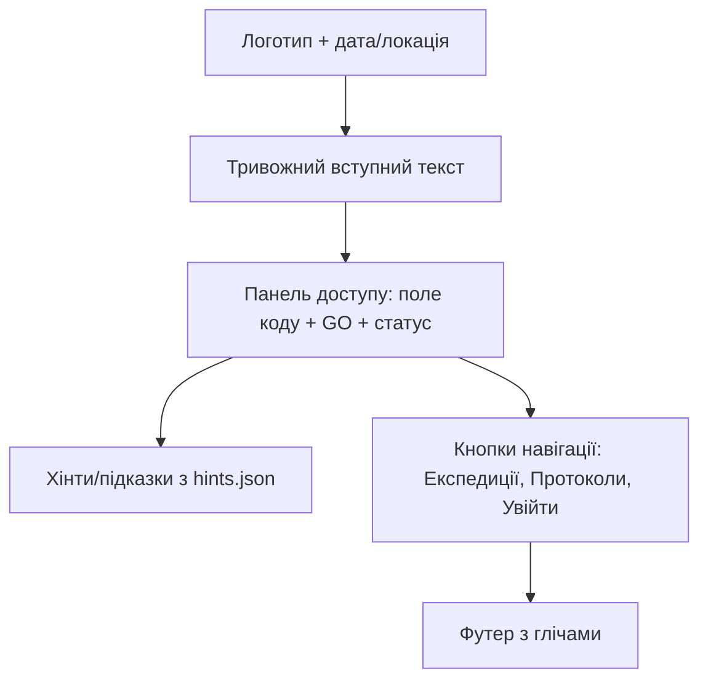
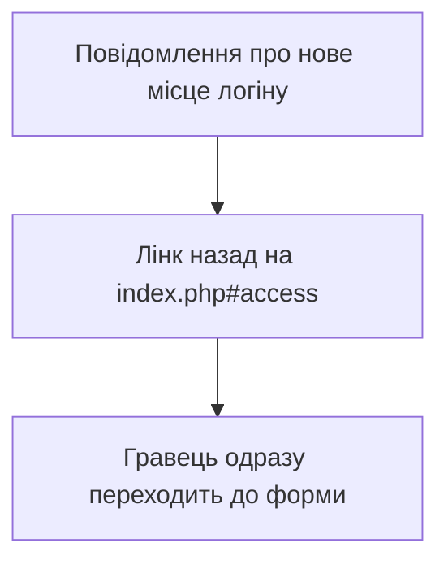
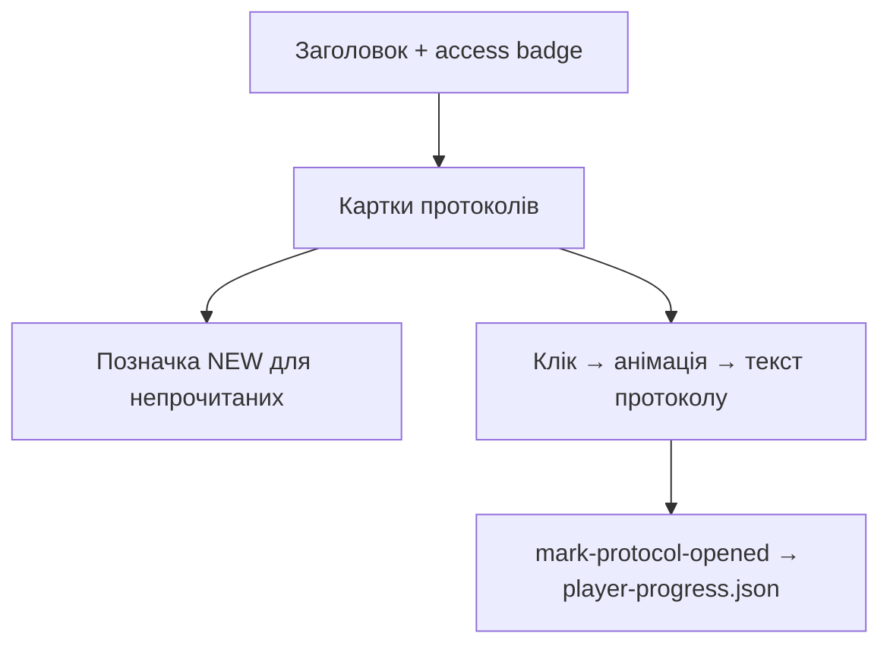
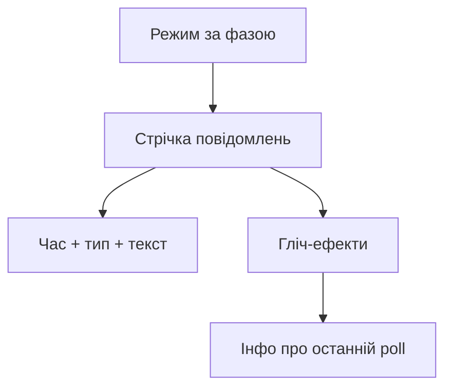
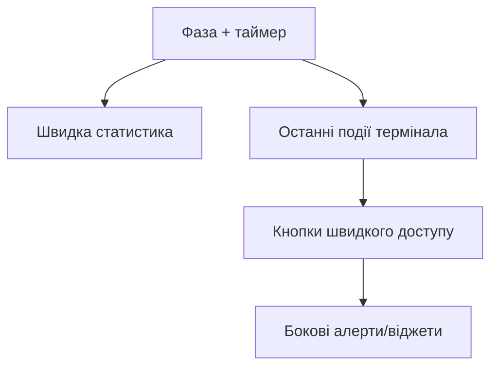
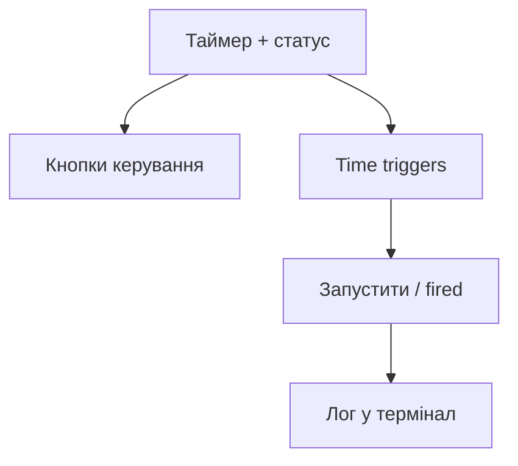
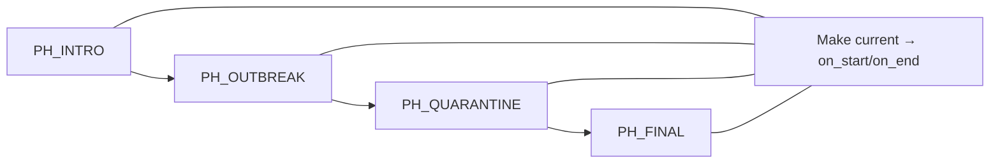
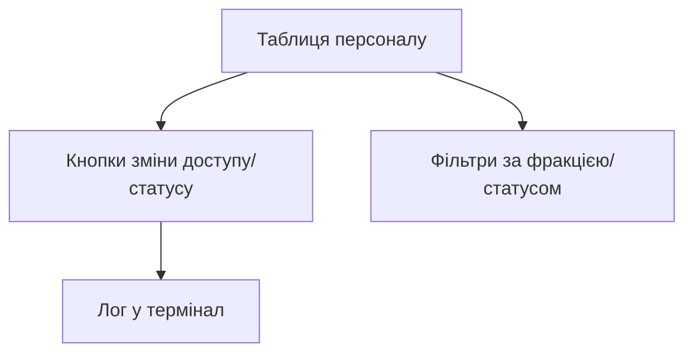
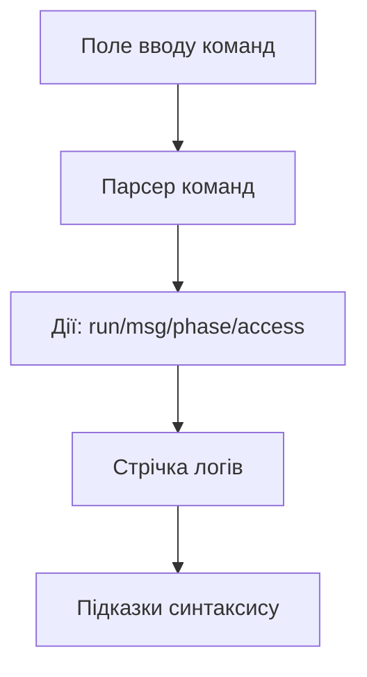
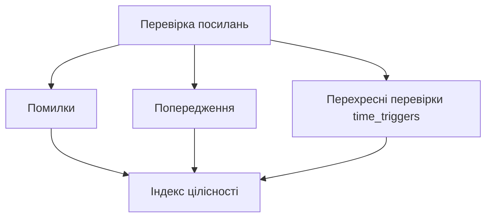

# Візуалізації HELIX ECHELON

Текстові макети для кожної сторінки. Вони допомагають швидко зорієнтуватися у структурі екранів без графічних файлів.

> Як побачити «картинки» тут і зараз: відкрийте цей файл у Markdown-просмотрі (GitHub, VS Code тощо) — усі схеми нижче намальовані в Mermaid і рендеряться як векторні діаграми прямо в репозиторії.

## Зміст
- [Публічні сторінки](#публічні-сторінки)
  - [index.php — Термінал входу](#indexphp--термінал-входу)
  - [login.php — Перенаправлення входу](#loginphp--перенаправлення-входу)
  - [player.php — Консоль гравця](#playerphp--консоль-гравця)
  - [expeditions.php — Реєстр експедицій](#expeditionsphp--реєстр-експедицій)
  - [protocols.php — Публічні протоколи](#protocolsphp--публічні-протоколи)
  - [protocols-player.php — Персональні протоколи](#protocols-playerphp--персональні-протоколи)
  - [terminal.php — Живий термінал](#terminalphp--живий-термінал)
- [Адмінські сторінки](#адмінські-сторінки)
  - [admin.php — Командний місток](#adminphp--командний-місток)
  - [admin-timer.php — Реактор часу](#admin-timerphp--реактор-часу)
  - [admin-phases.php — Перемикач фаз](#admin-phasesphp--перемикач-фаз)
  - [admin-protocols.php — Архів протоколів](#admin-protocolsphp--архів-протоколів)
  - [admin-players.php — Панель персоналу](#admin-playersphp--панель-персоналу)
  - [admin-quests.php — Сценарний реактор](#admin-questsphp--сценарний-реактор)
  - [admin-terminal.php — Консоль майстра](#admin-terminalphp--консоль-майстра)
  - [admin-diagnostics.php — Рентген системи](#admin-diagnosticsphp--рентген-системи)

---

## Публічні сторінки

### index.php — Термінал входу
```
┌────────────────────────────────────────────────────────────┐
│ HELIX логотип | Дата | Локація (затирання)                 │
├────────────────────────────────────────────────────────────┤
│ Вітальний текст з тривожним тоном + постійні глічі         │
├─────────────── Термінальна панель доступу ─────────────────┤
│ [Поле access-коду] [GO] | Статус: scanning…/validating…    │
│ Плаваючі підказки станції (hints.json)                     │
├────────────────────────────────────────────────────────────┤
│ Кнопки: [Експедиції] [Протоколи] [Увійти]                  │
└─────────────── Футер з дрібними шумами та глічами ─────────┘
```



### login.php — Перенаправлення входу
```
┌────────────────────────────────────────────────────────────┐
│ Інформаційний екран:                                      │
│ - Підказка, що введення коду доступу тепер на index.php    │
│ - Кнопка/посилання повернення до «Терміналу входу»         │
└────────────────────────────────────────────────────────────┘
```



### player.php — Консоль гравця
```
┌───────────── Таймер (12:00:00 ↓) + активна фаза ───────────┐
│ Гравець: Ім'я / Роль / Фракція / Badge рівня доступу       │
├───────────── Останні події (3–5) з термінала ──────────────┤
│ • [час] [тип] текст                                        │
│ • ...                                                      │
├───────────── Дії ------------------------------------------┤
│ [Експедиції]  [Мої протоколи]  [Термінал]                  │
└───────────── Нижня смуга гліч-підказок --------------------┘
```

```mermaid
flowchart TB
  A[Таймер + фаза] --> B[Профіль гравця (ім'я/роль/фракція/badge)]
  B --> C[Останні події з термінала]
  C --> D[Кнопки дій: Експедиції | Протоколи | Термінал]
  D --> E[Підказки/гліч-смуга]
```

### expeditions.php — Реєстр експедицій
```
┌───────────── Персонал станції HELIX (8) ───────────────────┐
│ • Прізвище/Ім'я — роль — статус (search/active/quarantine) │
│ • ...                                                      │
├───────────── Експедиція ВООЗ (8) ──────────────────────────┤
│ • Прізвище/Ім'я — роль — статус                            │
│ • ...                                                      │
├───────────── Корпорація ILARIA (8) ─────────────────────────┤
│ • Прізвище/Ім'я — роль — статус                            │
│ • ...                                                      │
└───────────── Підказки + легкі глічі -----------------------┘
```

```mermaid
flowchart TB
  A[Персонал HELIX (8)] --> A1[Роль + статус]
  B[Експедиція ВООЗ (8)] --> B1[Роль + статус]
  C[Корпорація ILARIA (8)] --> C1[Роль + статус]
  A --> D[Підказки/глічі]
  B --> D
  C --> D
```

### protocols.php — Публічні протоколи
```
┌───────────── Банер «Архів станції» + фазовий тег ──────────┐
│ [Плитки] Назва / короткий опис / рівень / фаза             │
│ [Статус] Публічний + активний; спорадичні попередження     │
└───────────── Нижня технічна смуга + підказки --------------┘
```

```mermaid
flowchart TB
  A[Банер «Архів» + фаза] --> B[Плитки протоколів]
  B --> C[Назва / опис / рівень / фаза]
  B --> D[Статус public+active | попередження]
  C --> E[Технічна смуга + підказки]
```

### protocols-player.php — Персональні протоколи
```
┌───────────── Заголовок + ваш рівень доступу ───────────────┐
│ [Картки] Назва / фазовий тег / іконка NEW якщо не читано   │
│ [Відкриття] клікаєш → шум/гліч → текст протоколу           │
└───────────── Прогрес зберігається через mark-protocol-opened┘
```



### terminal.php — Живий термінал
```
┌───────────── Фазовий режим (intro/outbreak/...) ───────────┐
│ Потік: [ігровий час] [тип] текст                           │
│ Глічі: пропуски, інверсія кольорів, миготіння              │
└───────────── Статус оновлення + час останнього poll --------┘
```



---

## Адмінські сторінки

### admin.php — Командний місток
```
┌───────────── Поточна фаза + глобальний таймер ─────────────┐
│ Швидка статистика: активні протоколи, гравці за статусом   │
├───────────── Останні 5–10 подій з термінала ───────────────┤
│ • ...                                                      │
├───────────── Кнопки швидкого доступу ----------------------┤
│ [Таймер] [Фази] [Квести] [Термінал] [Протоколи] [Гравці]   │
└───────────── Бокові віджети/алерти ------------------------┘
```



### admin-timer.php — Реактор часу
```
┌───────────── Великий таймер + стан (running/paused) ───────┐
│ Кнопки: Start | Pause | Resume | Reset                     │
├───────────── Time triggers --------------------------------┤
│ • (elapsed >=/ remaining <=) → quest_id                    │
│ • Тумблер fired                                            │
├───────────── Тестові події --------------------------------┤
│ [Запустити тригер]                                         │
└───────────── Лог дій → термінал ---------------------------┘
```



### admin-phases.php — Перемикач фаз
```
┌───────────── Чотири блоки фаз ------------------------------┐
│ PH_INTRO | PH_OUTBREAK | PH_QUARANTINE | PH_FINAL           │
│ Назва, опис, порядок, ui_intensity                         │
├───────────── Дії ------------------------------------------┤
│ [Зробити поточною] → запускає on_start/on_end квести       │
└───────────── Маркер активної фази -------------------------┘
```



### admin-protocols.php — Архів протоколів
```
┌───────────── Таблиця --------------------------------------┐
│ id | label | level | public | active | phase | publish_time│
│ Дії: редагувати, (де)активувати, «announce in terminal»    │
├───────────── Форма ----------------------------------------┤
│ Поля протоколу + чекбокси public/active/flags              │
└───────────── Нотатка про оголошення в терміналі -----------┘
```

```mermaid
flowchart TB
  A[Таблиця протоколів] --> B[Редагувати / (де)активувати]
  B --> C[Announce in terminal]
  A --> D[Форма протоколу + прапорці]
  D --> E[Збереження → оновлення JSON + лог]
```

### admin-players.php — Панель персоналу
```
┌───────────── Таблиця --------------------------------------┐
│ Ім'я | Фракція | Рівень доступу | Статус                   │
│ Кнопки: підвищити/знизити доступ, змінити статус           │
├───────────── Фільтри --------------------------------------┤
│ За фракцією, статусом                                     │
└───────────── Лог змін → термінал --------------------------┘
```



### admin-quests.php — Сценарний реактор
```
┌───────────── Список квестів -------------------------------┐
│ id | label | phase | subphase | опис                       │
│ [Запустити] → виконує actions                              │
├───────────── Дії квесту -----------------------------------┤
│ Відображення set_phase / push_terminal / set_access ...    │
└───────────── Позначка favorite для швидкого доступу -------┘
```

```mermaid
flowchart TB
  A[Список квестів] --> B[Кнопка «Запустити»]
  B --> C[Виконання actions (set_phase/push_terminal/...)]
  A --> D[Позначка favorite]
```

### admin-terminal.php — Консоль майстра
```
┌───────────── CLI команд -----------------------------------┐
│ Ввід: /run Q_ID | /msg public "..." | /phase PH_ID ...     │
├───────────── Стрічка логів --------------------------------┤
│ Всі admin/debug/system події                               │
└───────────── Підказки синтаксису команд -------------------┘
```



### admin-diagnostics.php — Рентген системи
```
┌───────────── Помилки --------------------------------------┐
│ Биті quest_id/protocol_id/phase_id, відсутні гравці        │
├───────────── Попередження ---------------------------------┤
│ Квести без actions, фази без квестів, протоколи без фази    │
├───────────── Перехресні перевірки -------------------------┤
│ time_triggers → quest_id                                   │
└───────────── Індекс цілісності даних ----------------------┘
```


